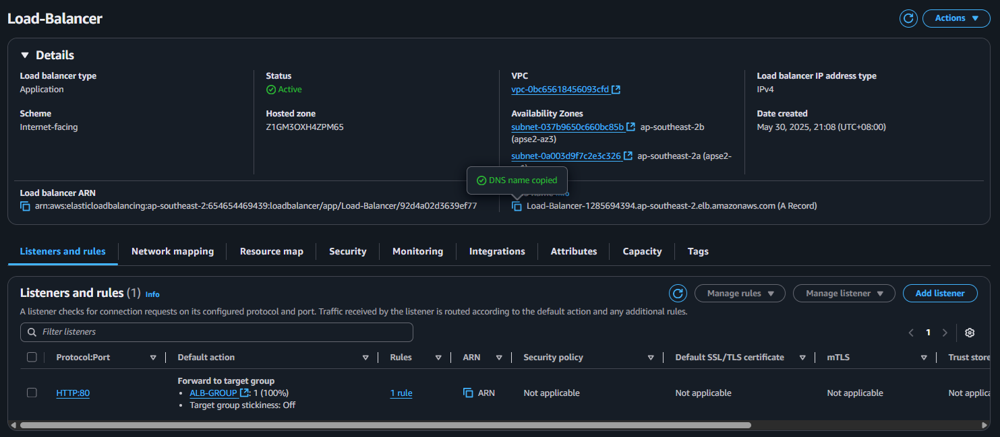
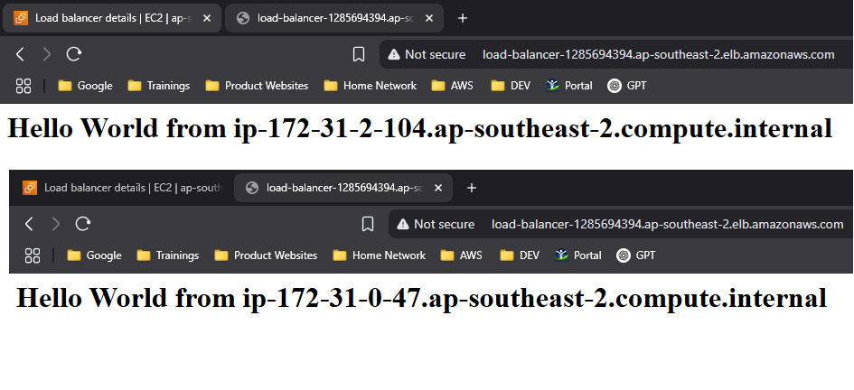

## <h1 style="text-align: center;">Example Architectural Diagram </h1>
   

---
First we need to create 2 instances that we want to implent Application Load Balancer
   
---
I added some basic Scripts to create a webserver and an 'echo' to identify what IP address of the instance are using
   
--- 
Checking the web server of both instances
    
---
Next is to Create an Load Balancer
    
---
Configuring the load balancer
   
---
Configuring the Network Mapping, Selecting which AZ are we going to select. `Note: select at least 2 AZ`
   
---
Next is we need to create another Security group `make sure to only allow port HTTP port 80 to the inbound rules or else The ALB will not receive any traffic`
   
---
After that, we need to create a target group `a target group is a logical group of instances that a load balancer can send traffic to`
   
---
Select the instances that you want to group and to load balance
   
---
here is the summary of the target group
   
---
here is the finish product
   
---
to check if the load balancer is working, the web server should have 2 IP Addresses Balancing
   
