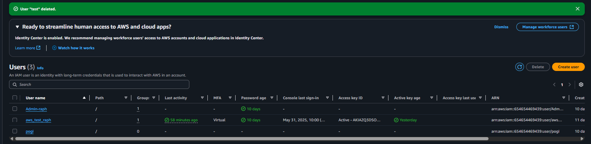

## <h1 style="text-align: center;"><Strong>Create IAM User </h1>

---
First we need to go services and search IAMFirst we need to go services and search IAM

   </img>

---

Here we can see the list of IAM user  

   </img>

---

Click create user and edit your preferences for the new IAM user 

   </img>

---

you can choose what to do the IAM user `add user to group` ,  `copy permission` or `attach policies directly`  </img>

   </img>
   </img> 

---

review your configuration and make sure to download the `.csv file` and email to the user  </img>

   </img>

---

Check the User Group `admin` and see if user `test` is there  </img>

   </img> 

---

## <h1 style="text-align: center;"> Create Access key for Programmically Use </h1>

   </img> 

---

Retrieve access keys for use and make sure to save it, because if we forgot either of the 2 we can't reset it and we need to replace it 
   </img>
---

Check the CLI in our machine and check if the IAM User can access the AWS CLI
   </img>
---

## <h1 style="text-align: center;">Delete IAM User </h1>
---

Go to the IAM User Console GUI and Click delete

   </img> 

---

Check the IAM Users if the User `test` is deleted

   </img> 
