## <h1 style="text-align: center;">Implementing Auto Scaling Group </h1>
---

Here is the Visual Presentation of how Auto-Scaling Group Works
   
---

First we need to create a Auto-Scaling Group, We can see the tab at the bottom of the left side in our EC2 GUI
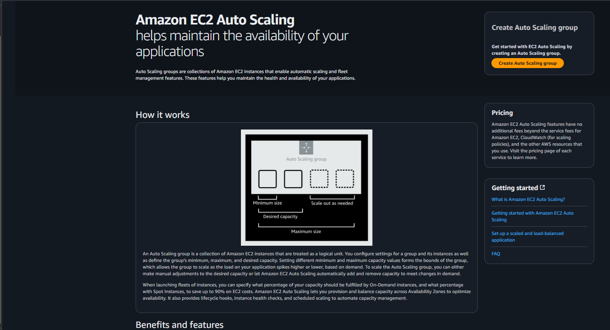   
---

In this Tab, we need to create a Launch Template.

An AWS Launch Template is a resource in Amazon EC2 that helps you define and store configuration details required to launch an instance. It’s like a blueprint for launching EC2 instances in a consistent and repeatable way.
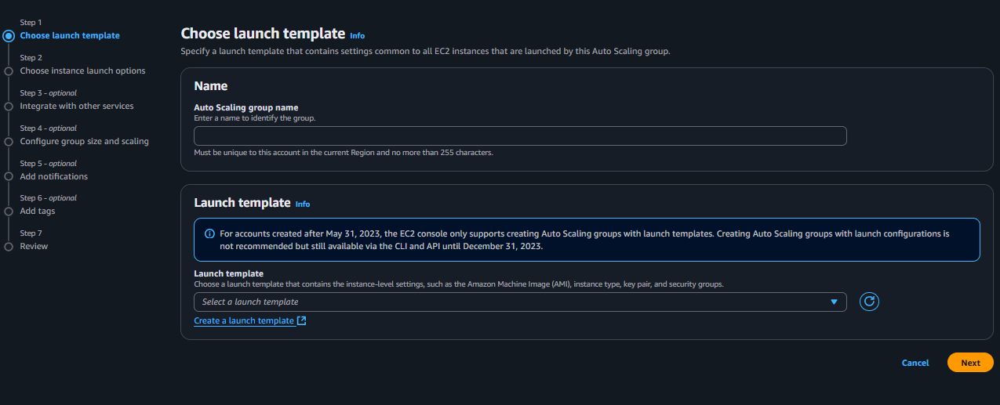   
---

Configuring my launch template
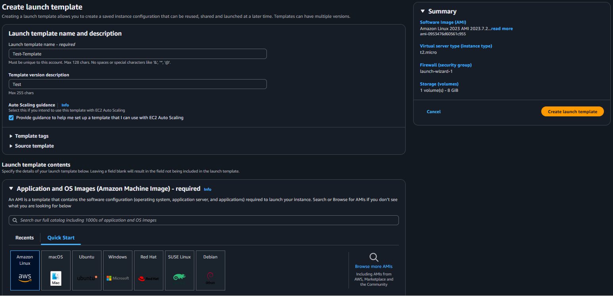   
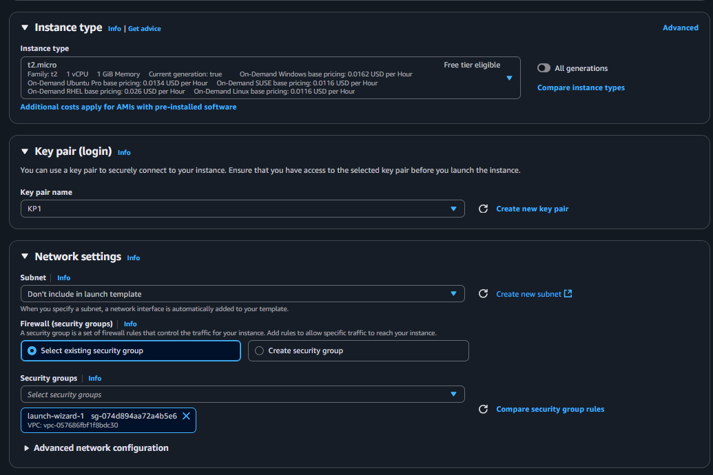   

Adding some basic Script to install a web server for visualization
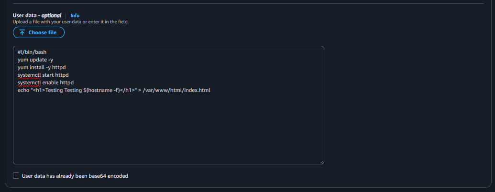    
---

Summary of Launch Template
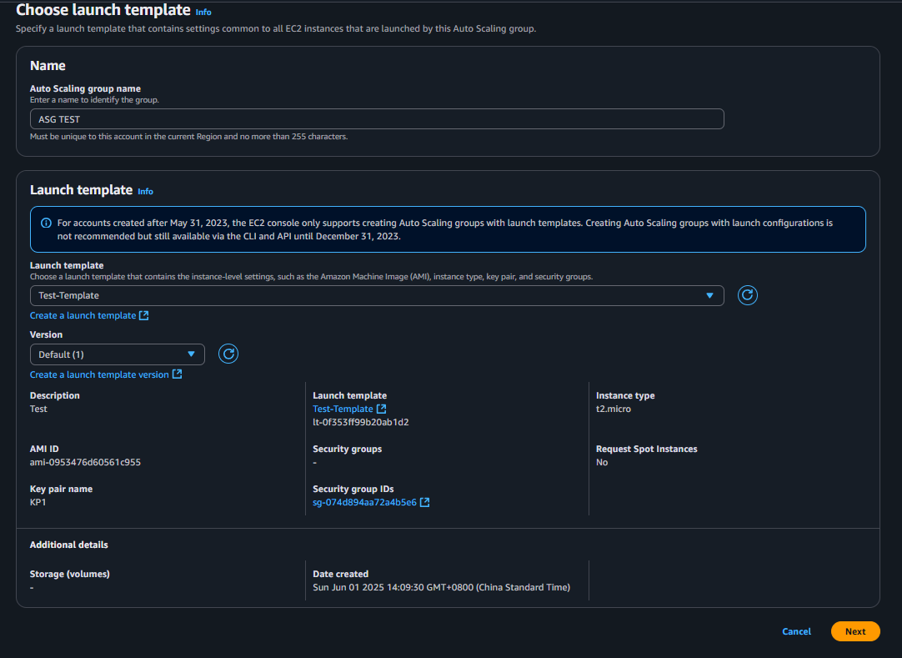   
---

Configuring Instance launch options
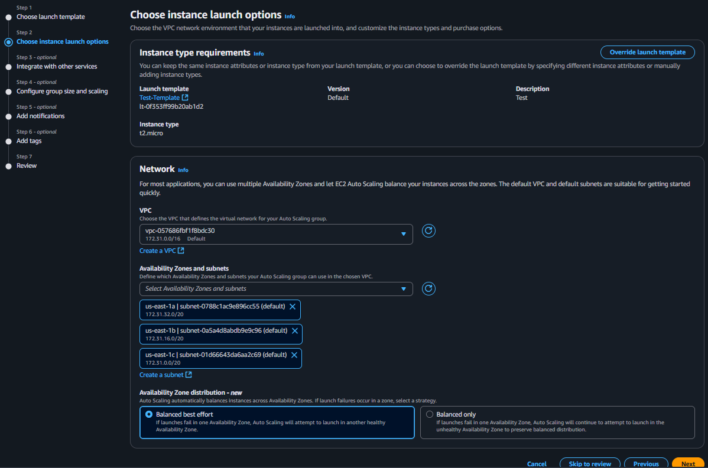   
---

In this section we can integrate our Auto-Scaling Group with other AWS services like Load balancer, ARC, Health Checks
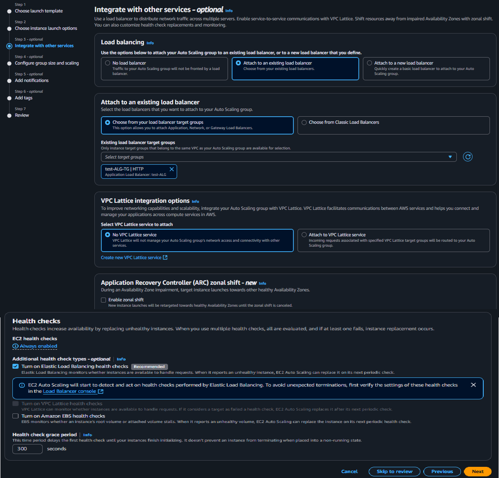    
---

In this section we will configure the group size and scaling of our Auto-Scaling Group
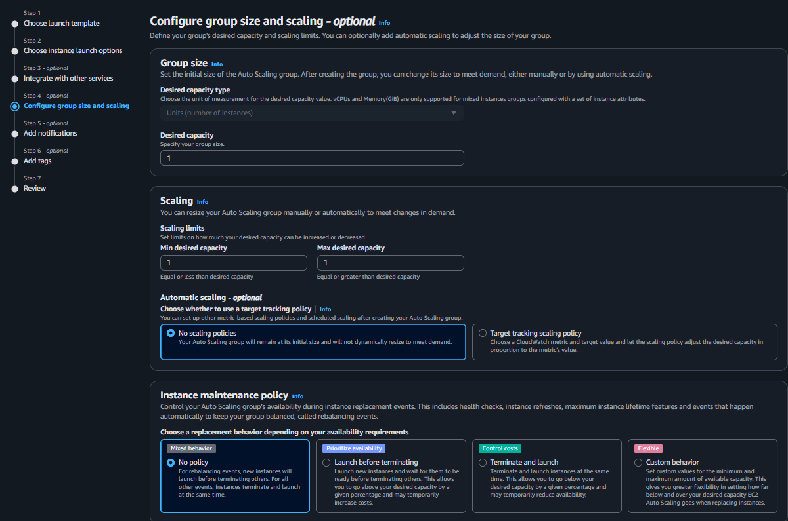   
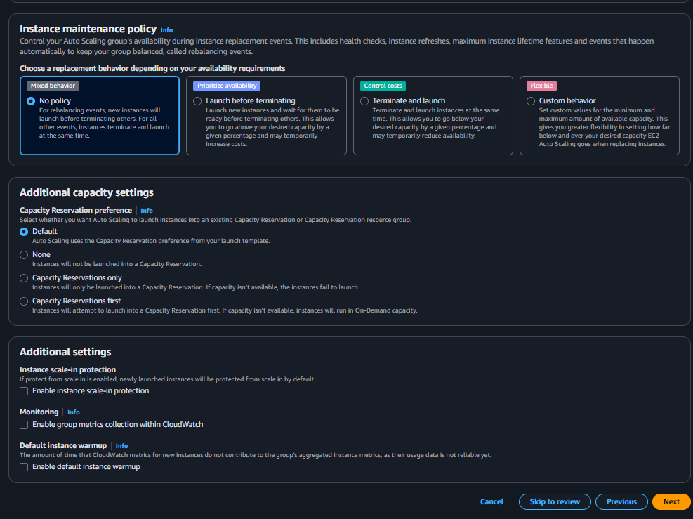   
---

We can also add notification but I will not add it because it is optional
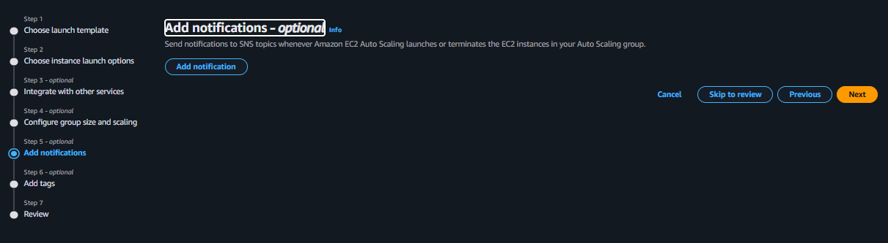   
---
Summary of our Auto-Scaling Group configuration
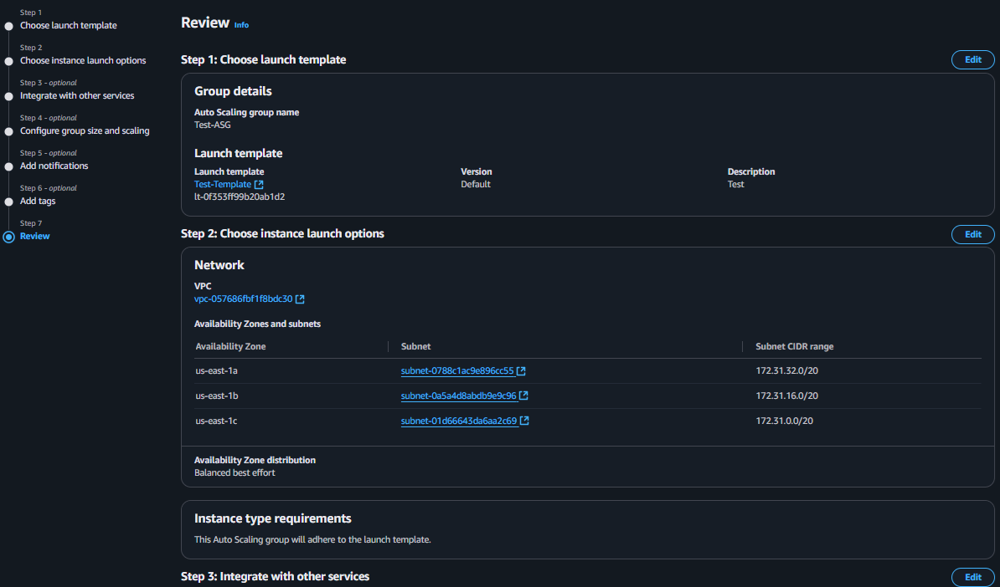   
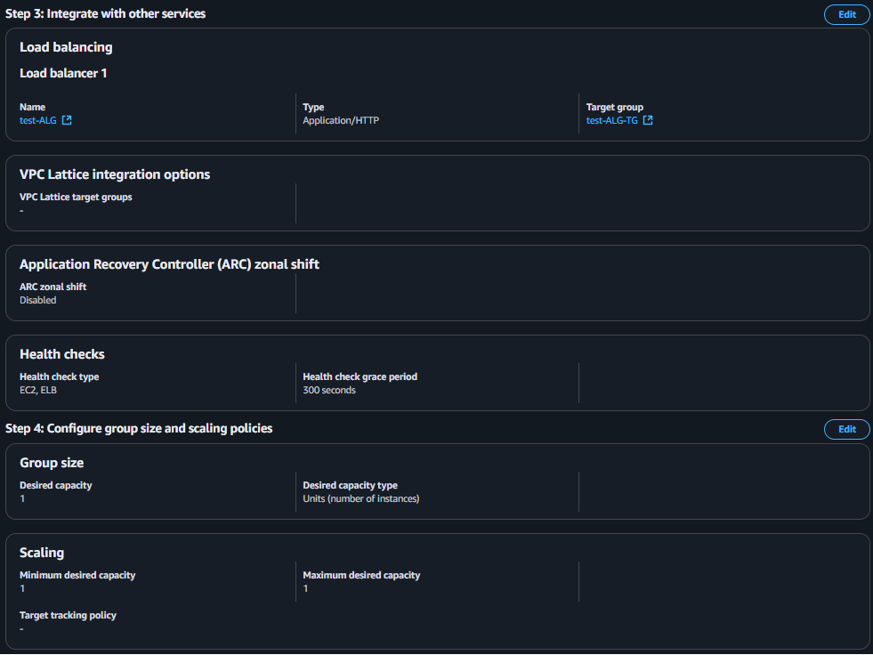   
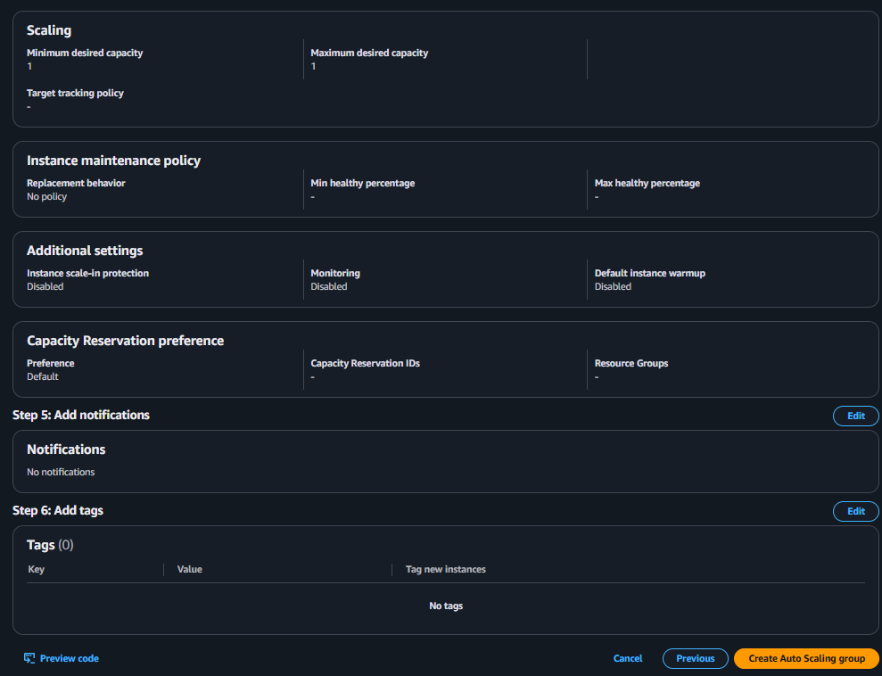   
---
Here is the overview of our newly created ASG
   
---
If we go to the activity tab, we can see that the Auto-Scaling Group automatically creates an instance because of our previous configuration that the minimum size of our Auto-Scaling Group is 1

0 ---> 1
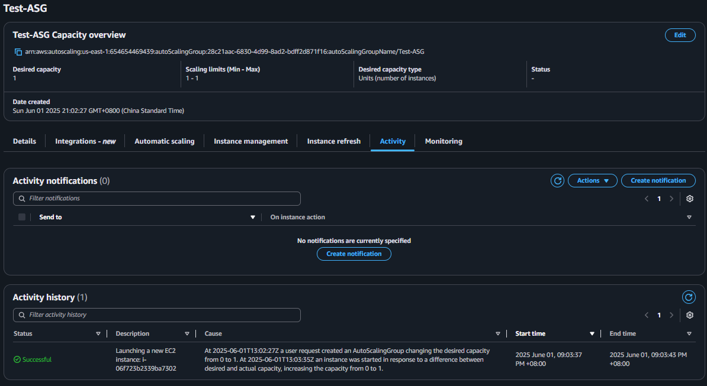   
   
---

If we look in to our Instance Tab, we can already see that the created instance is running
   
