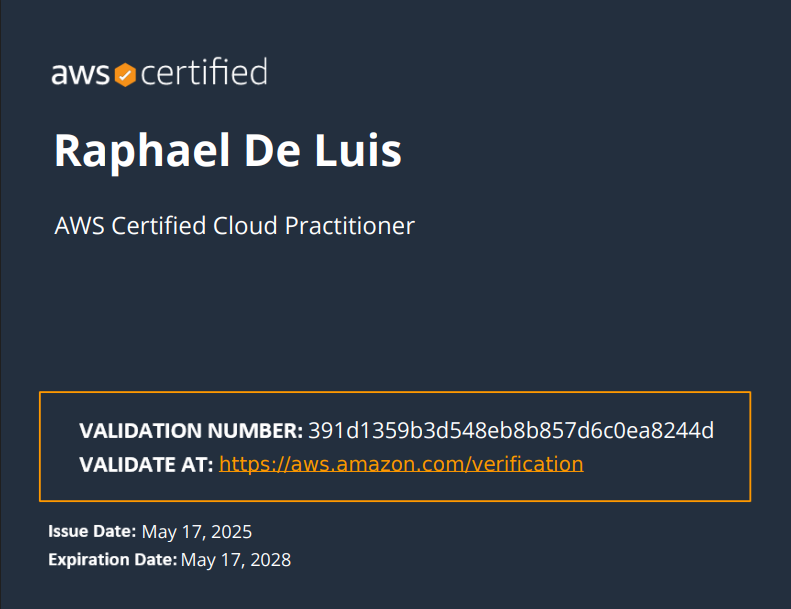

# <h1 style="text-align: center;"> Who Am I? </h1>

I'm Raphael De Luis, an IT enthusiast with practical experience in network engineering, system administration, and technical support, now actively focused on cloud technologies. I earned my Bachelor of Science in Information Technology from Quezon City University, and began my career at Trailblaizers Solutions Inc., where I transitioned from intern to full-time staff. There, I supported over 200 clients and contributed to the design and deployment of scalable IT and network solutions.

To continuously expand my expertise, I’ve earned certifications in AWS Cloud, Fortinet, Ruijie, and more. I maintain a dedicated home lab running Proxmox, NAS, and cloud-integrated enterprise simulations, where I explore concepts such as hybrid networking, infrastructure automation, and cloud security.

What drives me is the opportunity to be part of a team that builds reliable, scalable, and innovative solutions in the cloud. I am energized by the challenges and limitless potential of cloud computing and committed to supporting organizations in harnessing its full capabilities.

<h1 style="text-align: center;">My Certifications
<table>
  <tr>
    <td style="text-align:center;">
    <a href="Certifications/AWS%20Cloud%20Practitioner/" target="_blank">
       
      <em>AWS Cloud Practioner</em>
    </td>
    <td style="text-align:center;">
    <a href="Certifications/Six%20Sigma/" target="_blank">
       
      <em>Six Sigma - White Belt</em>
    </td>
    <td style="text-align:center;">
      <a href="Certifications/Fortinet/" target="_blank">
       
      <em>Fortinet Cybersecurity Associate</em>
    </td>
  </tr>
  <tr>
    <td style="text-align:center;">
      <a href="Certifications/Ruijie%20Certified%20Network%20Associate/" target="_blank">
       
      <em>Ruijie Certified Network Associate</em>
    </td>
    <td style="text-align:center;">
    <a href="Certifications/TP-Link/" target="_blank">
       
      <em>TP-Link Enterprise Switching and Routing
</em>
    </td>
    <td style="text-align:center;">
    <a href="Certifications/TP-Link/" target="_blank">
       
      <em>TP-Link Omada Certified Network Administrator</em>
    </td>
  </tr>
</table>

