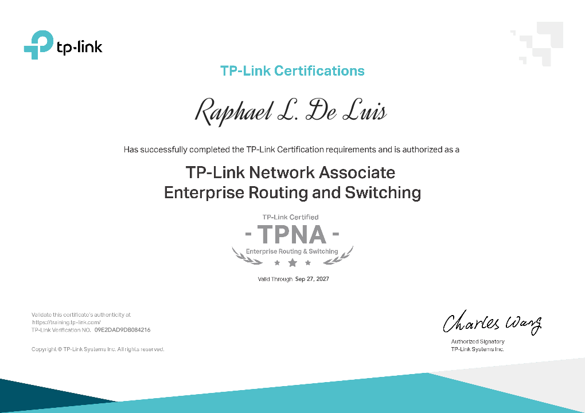

# <h1 style="text-align: center;"> Who Am I? </h1>

I'm Raphael De Luis, an IT enthusiast with hands-on experience in network engineering, system administration, and technical support, now actively focusing on cloud technologies. I earned my BS in Information Technology from Quezon City University and began my career at Trailblaizers Solutions Inc., where I transitioned from intern to full-time staff. In this role, I’ve supported over 200 clients and contributed to the design and deployment of scalable IT and network solutions.

I hold certifications in AWS Cloud, Fortinet, Ruijie, and more. To continuously build my expertise, I maintain a home lab running Proxmox, NAS, and cloud-integrated enterprise simulations. My current focus is on cloud infrastructure, hybrid networking, and automation, as I work toward designing secure, scalable, and efficient cloud-based environments.

<h1 style="text-align: center;">My Certifications
<table>
  <tr>
    <td style="text-align:center;">
    <a href="Certifications/AWS%20Cloud%20Practitioner/" target="_blank">
       
      <em>AWS Cloud Practioner</em>
    </td>
    <td style="text-align:center;">
    <a href="Certifications/Six%20Sigma/" target="_blank">
       
      <em>Six Sigma - White Belt</em>
    </td>
    <td style="text-align:center;">
      <a href="Certifications/Fortinet/" target="_blank">
       
      <em>Fortinet Cybersecurity Associate</em>
    </td>
  </tr>
  <tr>
    <td style="text-align:center;">
      <a href="Certifications/Ruijie%20Certified%20Network%20Associate/" target="_blank">
       
      <em>Ruijie Certified Network Associate</em>
    </td>
    <td style="text-align:center;">
    <a href="Certifications/TP-Link/" target="_blank">
       
      <em>TP-Link Enterprise Switching and Routing
</em>
    </td>
    <td style="text-align:center;">
    <a href="Certifications/TP-Link/" target="_blank">
       
      <em>TP-Link Omada Certified Network Administrator</em>
    </td>
  </tr>
</table>
